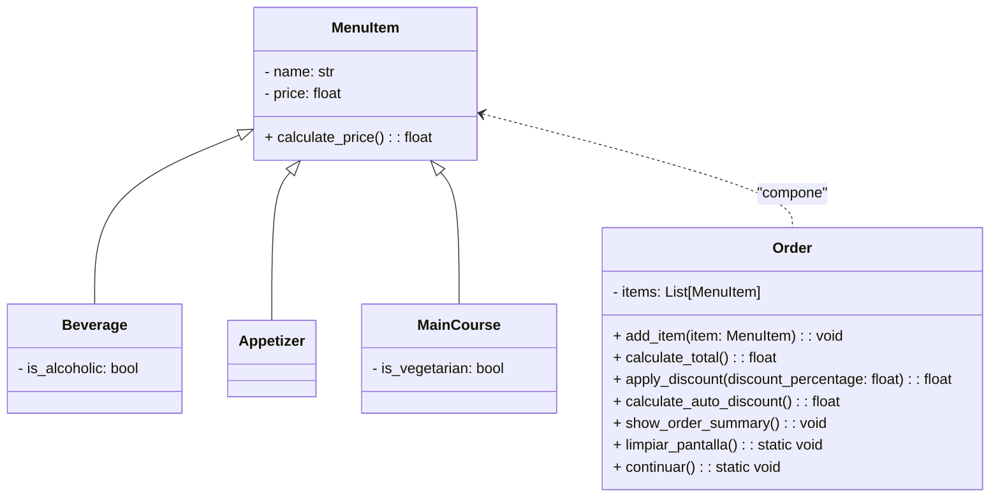

# Reto_03_POO
# Juan Pablo Rodríguez Cruz
1.
```
from math import atan,degrees
import os 

def limpiar_pantalla():
    """Limpia la consola."""
    os.system("cls" if os.name == "nt" else "clear")

def continuar():
        """Pausa la ejecución hasta que el usuario presione Enter."""
        input("\nPresiona Enter para continuar...")
        Calculadora.limpiar_pantalla()


class Point:
    def __init__(self, x: float=0, y: float=0):
        self.x = x
        self.y = y
    def move(self, new_x: float, new_y: float):
        self.x = new_x
        self.y = new_y
    def reset(self):
        self.x = 0
        self.y = 0
    def compute_distance(self, point)-> float:
        distance = ((self.x - point.x)**2+(self.y - point.y)**2)**(0.5)
        return distance

class Line:
    def __init__(self, start: Point, end: Point):
        self.start = start
        self.end = end
    
    def compute_length(self):
        return self.start.compute_distance(self.end)

    def compute_slope(self):
        x_displacement = self.end.x - self.start.x
        y_displacement = self.end.y - self.start.y
        if x_displacement == 0:
            return "Pendiente Indefinida"  # Pendiente indefinida en caso de ser una línea vertical
        else:
            return degrees(atan(y_displacement / x_displacement))

    def compute_horizontal_cross(self):
        if self.start.y > 0 and self.end.y > 0:
            return False
        if self.start.y < 0 and self.end.y < 0:
            return False
        else: return True

    def compute_vertical_cross(self):
        if self.start.x > 0 and self.end.x > 0:
            return False
        if self.start.x < 0 and self.end.x < 0:
            return False
        else: return True

class Rectangle:
    def __init__(self, width:float, height:float, center_point:float):
        self.width = width
        self.height = height
        self.center_point = center_point
    
    def compute_area(self):
        area = (self.width * self.height)
        return area
    
    def compute_perimeter(self):
        perimeter = (2*self.width + 2*self.height)
        return perimeter
    
    def compute_interference_point(self, Point):
        if Point.x < self.width and Point.y < self.height:
            return True
        else:
            return False


class Square(Rectangle):
    def __init__(self, edge, center_point):
        super().__init__(width = edge, height = edge, center_point = center_point)


while True:
    limpiar_pantalla()
    consulta = int(input("""
   
1. Usando Vertice inferior izquierdo(Point), ancho y altura
2. Usando Center(Point), ancho y altura
3. Usando dos vertices opuestos (Points)
4. Usando 4 lineas (Lines)
                         
Ingrese el número del método deseado: """))
    
    if consulta == 1:
        width = float(input("\nIngrese el ancho: "))
        height = float(input("\nIngrese la altura: "))

        bottom_left_corner_x = float(input("\nIngrese componente x del vertice inferior izquierdo: "))
        bottom_left_corner_y = float(input("\nIngrese componente y del vertice inferior izquierdo: "))
        bottom_left_corner_point = Point(bottom_left_corner_x , bottom_left_corner_y)
        
        center_point= Point(bottom_left_corner_x+(width/2),bottom_left_corner_y+(height/2))


    elif consulta == 2:
        width = float(input("Ingrese el ancho: "))
        height = float(input("Ingrese la altura: "))

        center_point_x = float(input("\nIngrese componente x del punto central: "))
        center_point_y = float(input("\nIngrese componente y del punto central: "))
        center_point = Point(center_point_x,center_point_y)
      

    elif consulta == 3:

        corner1_x = float(input("\nIngrese componente x del vertice de la izquierda: "))
        corner1_y = float(input("\nIngrese componente y del mismo vertice: "))

        opposite_corner_x = float(input("\nIngrese componente x del vertice opuesto: "))
        opposite_corner_y = float(input("\nIngrese componente y del vertice opuesto: "))

        width = abs(corner1_x-opposite_corner_x)
        height = abs(opposite_corner_y-corner1_y)

        center_point_x = height - (width/2)
        center_point_y = width - (height/2)
        center_point = Point(corner1_x+(width/2),corner1_y+(height/2))
    


    elif consulta == 4:
        start_x_width = float(input("Ingrese la coordenada x inicial del ancho: "))
        end_x_width = float(input("Ingrese la coordenada x final del ancho: "))
        start_y_width = float(input("Ingrese la coordenada y de inicio para el ancho: "))
        end_y_width = float(input("Ingrese la coordenada y de final para el ancho: "))

        start_x_height = float(input("Ingrese la coordenada x de inicio para el largo: "))
        end_x_height = float(input("Ingrese la coordenada x de final para el largo: "))
        start_y_height = float(input("Ingrese la coordenada y de inicio para el largo: "))
        end_y_height = float(input("Ingrese la coordenada y de final para el largo: "))

        horizontal_line = Line((Point(start_x_width, start_y_width)),(Point(end_x_width, end_y_width)))
        vertical_line = Line((Point(start_x_height, start_y_height)),(Point(end_x_height, end_y_height)))

       
        width = horizontal_line.compute_length()
        height = vertical_line.compute_length()

        center_point_x = (start_x_width + end_x_width) / 2
        center_point_y = (start_y_width + end_y_width) / 2
        
        center_point = Point(center_point_x,center_point_y)


    else:
        print("Error, intente de nuevo")
        continuar()
        continue
    break

Rctngl = Rectangle(width, height, center_point)
print("El área del rectángulo es ", Rctngl.compute_area(), "y el perímetro del rectángulo es", Rctngl.compute_perimeter())

Sqr = Square(edge = width or height, center_point = Point(center_point_x, center_point_y))
print("El área del cuadrado es ", Sqr.compute_area(), "y el perímetro es", Sqr.compute_perimeter())

horizontal_coord = int(input("Ingrese coordenada x de un punto: "))
vertical_coord = int(input("Ingrese coordenada y: "))
point = Point(horizontal_coord, vertical_coord)
contenencia = Rectangle.compute_interference_point(point)

if contenencia:
    print(f"El punto de coordenadas {horizontal_coord},{vertical_coord} está dentro del rectángulo")
else:
    print(f"El punto de coordenadas {horizontal_coord},{vertical_coord} NO está dentro del rectángulo")
```
``` python
from math import atan, degrees
import os
import numpy as np


def limpiar_pantalla():
    """Limpia la consola."""
    os.system("cls" if os.name == "nt" else "clear")


def continuar():
    """Pausa la ejecución hasta que el usuario presione Enter."""
    input("\nPresiona Enter para continuar...")


class Point:
    """Clase que representa un punto en el espacio 2D."""
    def __init__(self, x: float = 0, y: float = 0):
        self.x = x
        self.y = y


class Line:
    """Clase que representa una línea en el espacio 2D."""
    def __init__(self, start: Point, end: Point):
        self.start = start
        self.end = end
        self.length = self.compute_length()
        self.slope = self.compute_slope()

    def compute_length(self) -> float:
        """Calcula la longitud de la línea."""
        return ((self.end.x - self.start.x)**2 + (self.end.y - self.start.y)**2)**0.5

    def compute_slope(self):
        """Calcula la pendiente de la línea en grados desde la horizontal."""
        x_displacement = self.end.x - self.start.x
        y_displacement = self.end.y - self.start.y
        if x_displacement == 0:
            return None  # Pendiente indefinida para una línea vertical
        return degrees(atan(y_displacement / x_displacement))

    def compute_horizontal_cross(self) -> bool:
        """Verifica si la línea cruza el eje X."""
        return self.start.y * self.end.y <= 0

    def compute_vertical_cross(self) -> bool:
        """Verifica si la línea cruza el eje Y."""
        return self.start.x * self.end.x <= 0

    def discretize_line(self, n: int) -> np.ndarray:
        """Divide la línea en `n` puntos igualmente espaciados."""
        x_points = np.linspace(self.start.x, self.end.x, n)
        y_points = np.linspace(self.start.y, self.end.y, n)
        return np.array(list(zip(x_points, y_points)))


class Rectangle:
    """Clase que representa un rectángulo."""
    def __init__(self, top_line: Line, bottom_line: Line, left_line: Line, right_line: Line):
        self.top_line = top_line
        self.bottom_line = bottom_line
        self.left_line = left_line
        self.right_line = right_line

        # Calculamos el ancho y alto automáticamente
        self.width = self.top_line.compute_length()
        self.height = self.left_line.compute_length()

    def compute_area(self) -> float:
        """Calcula el área del rectángulo."""
        return self.width * self.height

    def compute_perimeter(self) -> float:
        """Calcula el perímetro del rectángulo."""
        return 2 * (self.width + self.height)


# Ejemplo de uso
if __name__ == "__main__":
    limpiar_pantalla()

    # Crear puntos para los vértices
    bottom_left = Point(0, 0)
    bottom_right = Point(4, 0)
    top_left = Point(0, 3)
    top_right = Point(4, 3)

    # Crear líneas
    bottom_line = Line(bottom_left, bottom_right)
    top_line = Line(top_left, top_right)
    left_line = Line(bottom_left, top_left)
    right_line = Line(bottom_right, top_right)

    # Crear rectángulo
    rect = Rectangle(top_line, bottom_line, left_line, right_line)

    print(f"Área del rectángulo: {rect.compute_area()}")
    print(f"Perímetro del rectángulo: {rect.compute_perimeter()}")

    continuar()
```
DIAGRAMA



CÓDIGO

```python
import os

class MenuItem:
    """Clase base para un elemento del menú."""

    def __init__(self, name, price):
        self.name = name
        self.price = price

    def calculate_price(self):
        return self.price


class Beverage(MenuItem):
    """Subclase para bebidas."""

    def __init__(self, name, price, is_alcoholic):
        super().__init__(name, price)
        self.is_alcoholic = is_alcoholic


class Appetizer(MenuItem):
    """Subclase para aperitivos."""

    def __init__(self, name, price):
        super().__init__(name, price)
      


class MainCourse(MenuItem):
    """Subclase para platos principales."""

    def __init__(self, name, price, is_vegetarian):
        super().__init__(name, price)
        self.is_vegetarian = is_vegetarian


class Order:
    """Clase que representa el pedido de un cliente."""

    def __init__(self):
        self.items = []

    def add_item(self, item):
        if isinstance(item, MenuItem):
            self.items.append(item)
        else:
            raise ValueError("El elemento debe ser un objeto de tipo MenuItem")

    def calculate_total(self):
        return sum(item.calculate_price() for item in self.items)

    def apply_discount(self, discount_percentage):
        total = self.calculate_total()
        discount = total * (discount_percentage / 100)
        return total - discount

    def calculate_auto_discount(self):
        combos = {
            ("Mojarra", "Ceviche", "Limonada de Coco"): 12,
            ("Mojarra", "Empanadas de camarón(4und)", "Limonada de Coco"): 10,
            ("Chunchullo", "Bandeja Paisa"): 8,
            ("Churrasco", "Empanadas de carne(4und)"): 8,
            ("Medio Churrasco", "Empanadas de carne(4und)"): 5
        }
        
        applied_discount = 0
        for combo, discount in combos.items():
            if all(any(item.name == combo_item for item in self.items) for combo_item in combo):
                applied_discount = max(applied_discount, discount)
        return applied_discount

    def show_order_summary(self):
        print("Resumen del pedido:")
        for item in self.items:
            print(f"{item.name}: ${item.price:.2f}")
        print(f"Total: ${self.calculate_total():.2f}")

    @staticmethod
    def limpiar_pantalla():
        """Limpia la consola."""
        os.system("cls" if os.name == "nt" else "clear")

    @staticmethod
    def continuar():
        """Pausa la ejecución hasta que el usuario presione Enter."""
        input("\nPresiona Enter para continuar...")
        Order.limpiar_pantalla()


def menu_principal():
    menu = [
        Beverage("Gaseosa 600 mL", 7000, False),
        Beverage("Cerveza artesanal", 15000, True),
        Beverage("Cerveza Heineken botella", 10000, True),
        Beverage("Limonada de coco", 10000, False),
        Beverage("Agua", 5000, False),
        Appetizer("Empanadas de pollo(4und)", 10000),
        Appetizer("Empanadas de carne(4und)", 10000),
        Appetizer("Empanadas de camarón(4und)", 12000),
        Appetizer("Chunchullo", 18000),
        Appetizer("Ceviche", 15000),
        MainCourse("Churrasco", 40000, False),
        MainCourse("Medio Churrasco", 28000, False),
        MainCourse("Bandeja Paisa", 38000, False),
        MainCourse("Hamburguesa", 33000, False),
        MainCourse("Hamburguesa vegetariana", 36000, True),
        MainCourse("Mojarra", 38000, False)
    ]

    order = Order()

    while True:
        Order.limpiar_pantalla()
        print("Menú del Restaurante:")
        print("\n--- Bebidas ---")
        for i, item in enumerate(menu, start=1):
            if isinstance(item, Beverage):
                print(f"{i}. {item.name} - ${item.price:.2f}")
        print("\n--- Aperitivos ---")
        for i, item in enumerate(menu, start=1):
            if isinstance(item, Appetizer):
                print(f"{i}. {item.name} - ${item.price:.2f}")
        print("\n--- Platos principales ---")
        for i, item in enumerate(menu, start=1):
            if isinstance(item, MainCourse):
                print(f"{i}. {item.name} - ${item.price:.2f}")

        try:
            choices = input("\nIngrese los números de los items separados por comas: ").strip()

            choices = [int(choice) - 1 for choice in choices.split(",") if choice.strip().isdigit()]
            for choice in choices:
                if 0 <= choice < len(menu):
                    order.add_item(menu[choice])
                    print(f"{menu[choice].name} agregado al pedido.")
                else:
                    print(f"El número {choice + 1} no es válido y se ignoró.")
        except ValueError:
            print("\nEntrada inválida. Por favor, ingrese solo números separados por comas.")

        confirm = input("\n¿Desea agregar más items? (s/n): ").strip().lower()
        if confirm != 's':
            break

    Order.limpiar_pantalla()
    print("\nResumen Final del Pedido:")
    order.show_order_summary()

    confirm = input("\n¿Confirma su pedido? (s/n): ").strip().lower()
    if confirm == 's':
        auto_discount = order.calculate_auto_discount()
        if auto_discount > 0:
            print(f"\nSe ha aplicado un descuento automático del {auto_discount}%.")
            total_with_discount = order.apply_discount(auto_discount)
            print(f"Total después del descuento: ${total_with_discount:.2f}")
        else:
            print("\nNo se aplicó ningún descuento automático.")

        print("\nGracias por su pedido. Que tenga un buen día.")
    else:
        print("\nEl pedido fue cancelado.")


if __name__ == "__main__":
    menu_principal()
```

